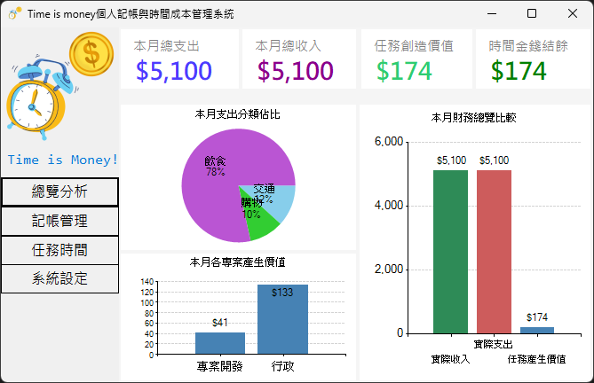
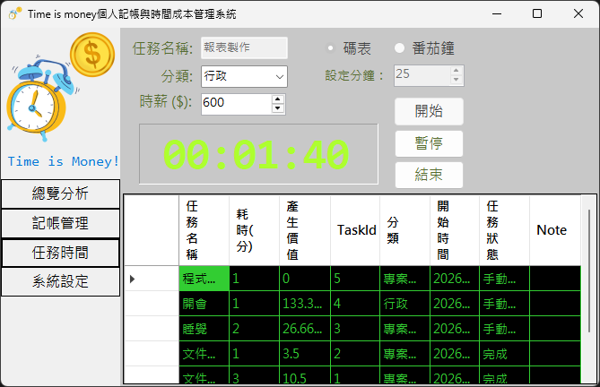
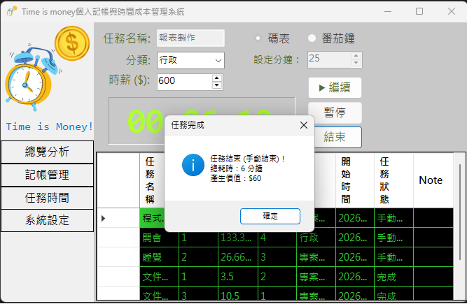
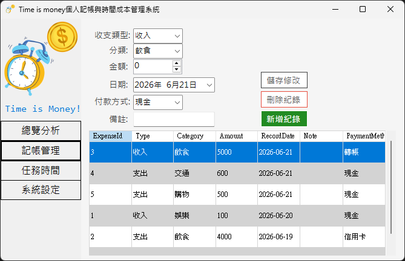

# TimeisMoney - 個人記帳與時間價值管理系統

##  專案簡介
「TimeisMoney」是一款結合了「傳統金錢記帳」與「時間成本換算」的整合型桌面應用程式。本系統的設計理念是將無形的「時間」量化為實質的「金錢價值」，讓使用者在管理日常收支的同時，也能清楚追蹤並視覺化自己在各項專案與任務上所投入的時間成本與產出價值，進而達到更全面的自我管理。

##  核心功能
* **總覽分析 (Dashboard)**：即時計算本月總收入、總支出與任務創造價值，並提供收支比較長條圖與支出分類圓餅圖。
* **記帳管理 (Expense)**：提供完整的新增、修改、刪除 (CRUD) 功能，支援收入與支出的詳細分類與紀錄。
* **任務時間 (Task Time)**：內建具備科技感復古電子鐘的計時器，支援「正向碼表」與「倒數番茄鐘」雙模式，任務結束後自動依時薪換算產生價值。
* **系統設定 (Settings)**：支援將記帳與任務紀錄匯出為相容於 Excel 的 `.csv` 報表 (無中文亂碼)，並提供一鍵備份 SQLite `.db` 資料庫功能。

##  技術架構
* **開發語言**：C#
* **介面框架**：Windows Forms (.NET)
* **資料庫**：SQLite (使用 `Microsoft.Data.Sqlite` 套件)
* **圖表元件**：`System.Windows.Forms.DataVisualization.Charting`

##  執行與編譯說明
1. **環境要求**：請確認已安裝 Visual Studio (建議 2019 或更新版本) 與 .NET 桌面開發工作負載。
2. **開啟專案**：下載並解壓縮專案資料夾後，點擊 `TimeisMoney.sln` 開啟方案。
3. **還原套件**：若 Visual Studio 未自動還原 NuGet 套件，請在「方案總管」對專案按右鍵，選擇「管理 NuGet 套件」，確認 `Microsoft.Data.Sqlite` 已正確安裝。
4. **編譯執行**：請於上方選單點選「建置」>「重建方案」，確認無誤後，按下 `F5` 即可啟動應用程式。系統會在首次啟動時自動於執行目錄下建立 `TimeIsMoney.db` 資料庫檔案。

##  畫面截圖
### 總覽分析儀表板

### 復古電子鐘與任務計時

### 記帳紀錄管理

